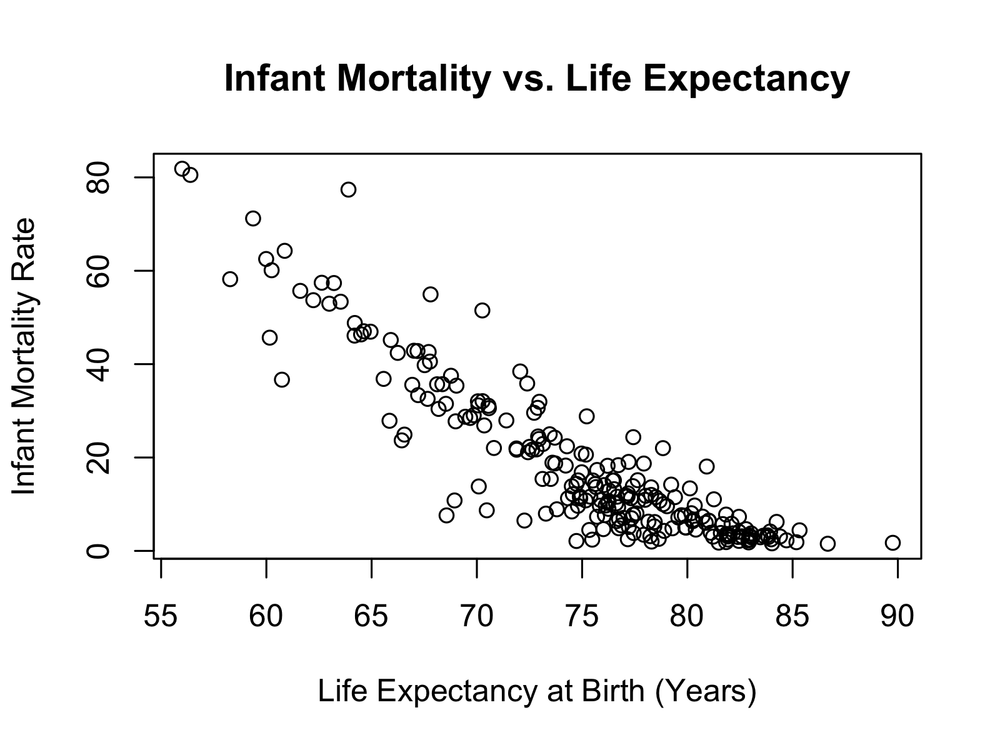

# 🌍 Predicting Life Expectancy From Country Demographic

## Project Overview

This project is the final assignment for STAT 418. It aims to predict **Life Expectancy at Birth** (`E0`) for various countries using publicly available demographic indicators. The model is both practical and straightforward, with real-world applications in population. It features an end-to-end pipeline: **data collection**, **model building**, **exploratory analysis**, and **interactive deployment** via a web app and Flask API.

- Link to Shiny APP: [Shiny App](https://gaohongc.shinyapps.io/life_expectancy/)

## Data Collection

The data was collected from the **U.S. Census Bureau International Data Base (IDB)** using their public API:

**URL**: [https://www.census.gov/data-tools/demo/idb](https://www.census.gov/data-tools/demo/idb)


### The dataset includes the following variables for 2024:
- `POP`: Total Population
- `GR`: Annual Growth Rate
- `RNI`: Rate of Natural Increase
- `POP_DENS`: Population Density
- `TFR`: Total Fertility Rate
- `CBR`: Crude Birth Rate
- `IMR`: Infant Mortality Rate
- `CDR`: Crude Death Rate
- `E0`: Life Expectancy at Birth (Target Variable)

Raw JSON responses were processed and converted into a clean tabular dataset using R.

## Exploratory Data Analysis (EDA)

To better understand the characteristics of the dataset, below is an overview of the exploratory data analysis (EDA).


Most countries around the world have a life expectancy at birth between 70 and 80 years, indicating generally good health conditions in many regions. A smaller group of countries falls below 65 years, likely due to challenges like limited access to healthcare or higher infant mortality rates. On the other hand, a few countries boast life expectancies exceeding 85 years. Overall, the distribution is slightly left-skewed.



Countries with higher infant mortality rates tend to have much lower life expectancy at birth. As infant mortality goes down, life expectancy improves significantly. You can see that countries with very low infant mortality are clustered around the higher end of the life expectancy scale.

### Correlation Plot


The correlation heatmap indicates the relationship between various demographic indicators and life expectancy. One of the strongest patterns is a robust negative correlation between the infant mortality rate and life expectancy (−0.90), which supports the earlier insight from the scatter plot. Similarly, total fertility rate is also strongly negatively related to life expectancy (−0.77). On the other hand, variables like population size and population density show little to no correlation with life expectancy.

## Methodology
This project utilizes a multiple linear regression model to predict Life Expectancy based on a set of demographic indicators. The features included in the model are: Population, Growth Rate, Natural Increase, Population Density, Fertility Rate, Birth Rate, Infant Mortality Rate, Death Rate, and Net Migration Rate. The complete implementation, including data preprocessing, model training, and prediction logic, can be found in the script named `prediction.py`.


## Deployment

### Flask API: Accessing on local machine
1. Clone this repo to your local machine.
2. `cd` to the director of `Final-Flask-api`
3. To run this API, change your directory to the docker folder and run:

   `docker compose up -d`

4. Open a new terminal and run the following code to get a response `server is up - nice job!`

   `curl http://localhost:8080/`

5. Finally, send a test prediction by making a curl POST request to the API locally using the command below:
```
curl -X POST http://localhost:8080/predict_price \
  -H "Content-Type: application/json" \
  -d '{
    "Population": 1000000,
    "Annual Growth Rate": 1.2,
    "Population Density": 500,
    "Total Fertility Rate": 2.3,
    "Infant Mortality Rate": 20,
    "Crude Death Rate": 8
  }'

```
### Assessing the FLASK API through GOOGLE CLOUD
The predictive model is hosted on GOOGLE CLOUD and it is accessible using the following curl command:

```
curl -X POST https://final-project-flask-app-693104809772.us-central1.run.app/predict_price \
  -H "Content-Type: application/json" \
  -d '{
    "Population": 1000000,
    "Annual Growth Rate": 1.2,
    "Population Density": 500,
    "Total Fertility Rate": 2.3,
    "Infant Mortality Rate": 20,
    "Crude Death Rate": 8
}'
```
Then you will receive the following response:
```
{"predicted life expectancy":74.78086113064549}
```

## Results
The Shiny app offers an interactive interface that enables users to estimate life expectancy based on key demographic indicators. Users can select a country (for reference only) and input values. 
Once the data is entered, clicking the Predict button sends the input to a deployed Flask API hosted on Google Cloud Run, which returns the predicted life expectancy in years. 
This interface enables users to explore how changes in demographic factors affect life expectancy, making it a valuable and informative tool for understanding global health trends.


### App Workflow
The diagram below shows how the Shiny app interacts with the Flask API to generate a life expectancy prediction:

```
+-------------+      +-----------+      +--------------------------+      +----------------------------+
| User Input  | ---> | Shiny UI  | ---> | Flask API (Google Cloud) | ---> |Life Expectancy Prediction  |
+-------------+      +-----------+      +--------------------------+      +----------------------------+
```
1. **User Input**: The user enters demographic data into the Shiny interface.
2. **Shiny UI**: The frontend collects and sends the data.
3. **Flask API (Google Cloud)**: The backend receives the data, runs the model, and returns a prediction.
4. **Life Expectancy Prediction**: The result is displayed back to the user in the app.

                                           


